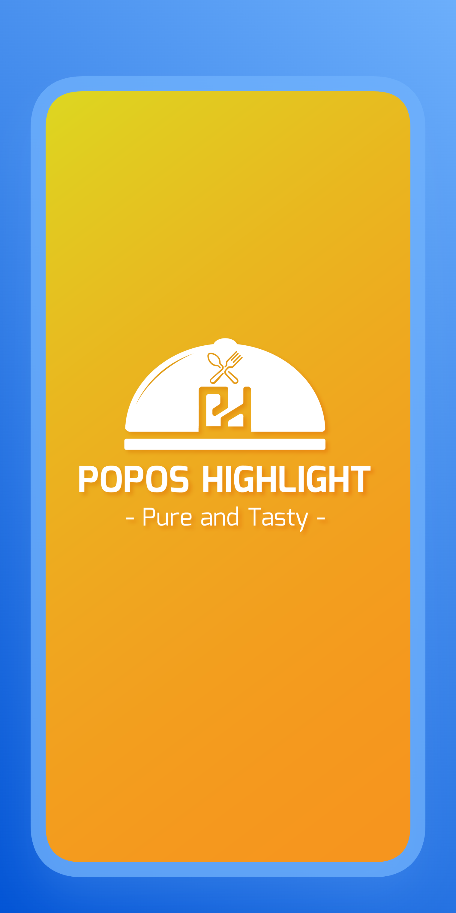
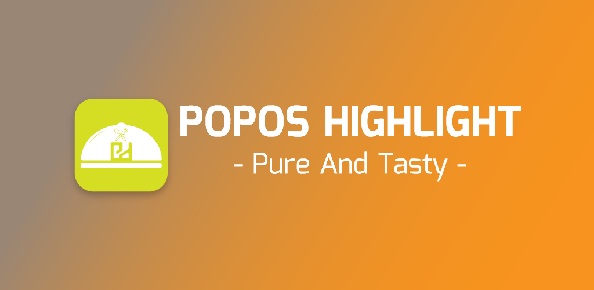

<h1 align="center">Hi 👋, I'm <a href="https://github.com/niyajali/" target="blank">
Niyaj</a></h1>

### About Me

A technology-enthusiastic, detail-oriented, and committed engineer, experienced in web and android development using the
latest technologies and tools. especially in **Android | Kotlin | PHP | Laravel | Javascript** programming languages
and frameworks.

[//]: # (https://github.com/)
 

    
    
    

[//]: # (![Profile Views]&#40;https://komarev.com/ghpvc/?username=niyajali&style=flat-square&#41;)
 

<table width="100%" align="center">
 <tr>
    <td width="60%">

## 🛠️ Skills

#### Languages

 
    
    
  
  
  
  
  

#### Frameworks

    
  
  
  
  
  
  
  

#### Database

  
  
  

#### Tools and Technologies

  
  
  

#### IDE

    

</td>
    <td>

## 📄📜 Stats

  
  
  
  
  
     

  </td>
 </tr>
</table>
